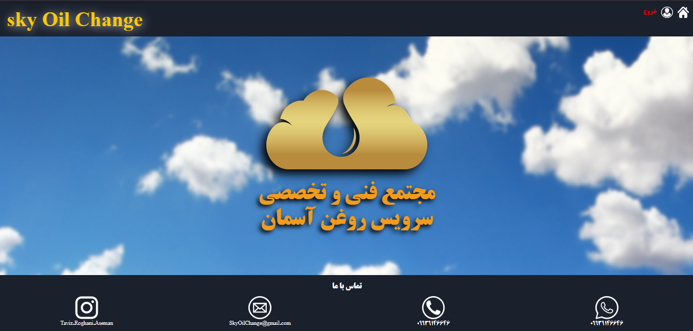
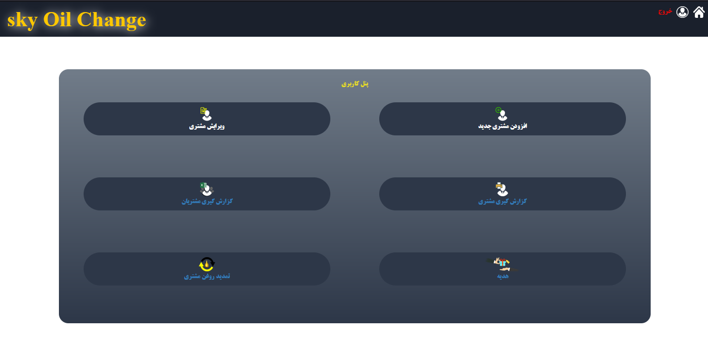
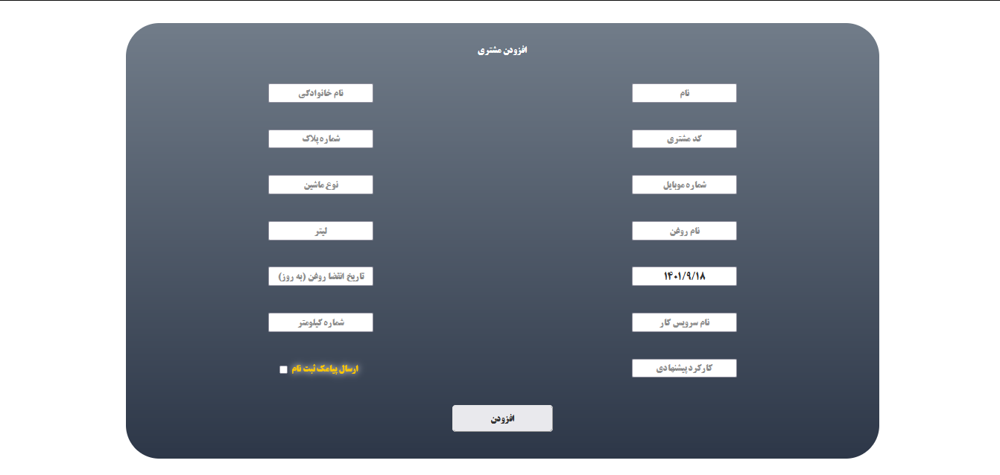
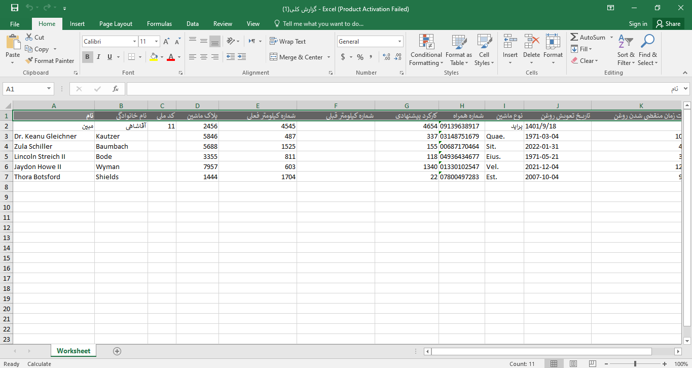
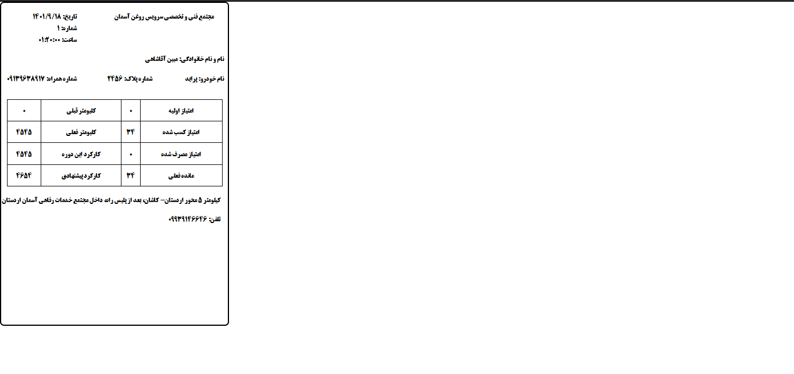
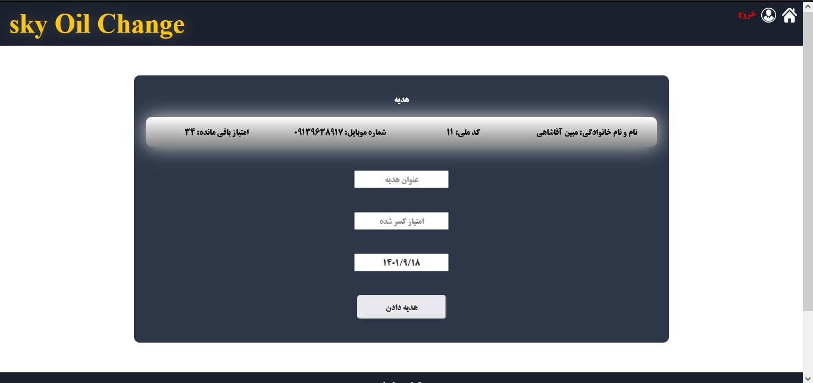

# About project (skyOil)
This program is made for an oil change that sends a message to customers to change their oil based on a series of parameters. this project made by Laravel
## Features

* Customer management
  * Add Customer
  * Delete Customer
  * Edit Customer
* Customer reporting
  * Excel
  * Printable
* Gift giving
* Sending welcome SMS to the customer
* Sending oil change reminder SMS to the customer
***

## Images of the program environment

**Index Page**

**Admin Panel Page**

**Add Customer Page**

**Reporting Excel Export**

**Printable report**

**Gift giving Page**

## Visit This webSite
http://myhomeiot.ir
